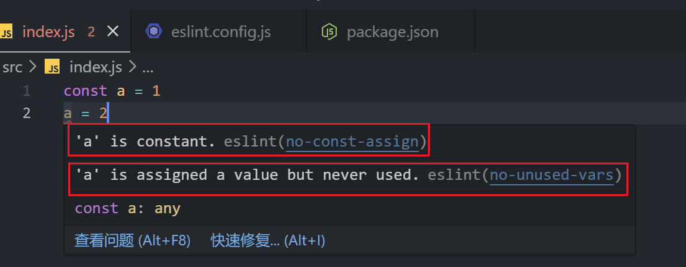
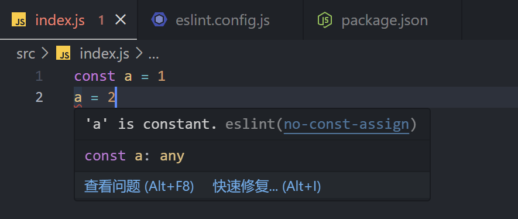
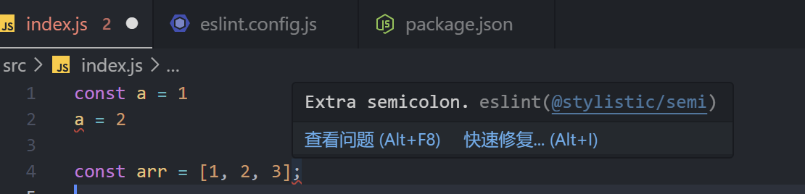

# 代码校验与美化

搭好了项目，迫不及待想要编码？

我知道你很急，但你先别急。开始编码前，先想想：现在所工作的项目是多人协作的情况吗？如果是，那么你需要做好这些事：

1. 制定一套完善的、符合团队现状的编码规范；
2. 使用一些工具管控编码风格的统一性，基于机制而不是约定。

## 要做什么？

制定编码规范的目的是对 **代码** 进行 **规范性** 校验，我们先考虑第一个问题：对什么代码进行校验？

我们以前端开发为例（但其实不限于前端的开发，也可以是Node服务端的开发），看看我们平时都在跟什么代码打交道：

| 场景 | 代码类型 |
| -- | -- |
| 写逻辑 | `.js` `.ts` |
| 写组件 | `.jsx` `.tsx` |
| 写样式 | `.css` `.scss` `.less` |
| 写配置 | `.json` `.yaml` |
| 写文档 | `.md` |

我们会写各种类型的代码，因此就需要对各种类型的代码制定不同的编码规范并校验。这是一件非常消耗耐心的事情。

但是！你可以根据自己项目的需要，选择编码规范要做到什么程度。就我个人而言，我选择：

| 场景 | 代码类型 | 编码规范制定 |
| -- | -- | -- |
| 写逻辑 | `.js` `.ts` | ✅ 必备 |
| 写组件 | `.jsx` `.tsx` | ✅ 必备 |
| 写样式 | `.css` `.scss` `.less` | ❌ 不做，项目选用 `TailwindCSS`，样式代码极少 |
| 写配置 | `.json` `.yaml` | 🐢 渐进式做 |
| 写文档 | `.md` | 🐢 渐进式做 |

确定好要对哪些代码制定编码规范，接下来，我们聊一聊制定规范要做的具体事情。让我们先看看这两段代码：

| 好的代码 | 差的代码 |
| -- | -- |
| `let a = 1; a = 2;` | `const a = 1; a = 2;` |
| `const arr = [1, 2, 3]` | `const arr = [1, 2, 3];` |

对第一段代码，相信你没有异议，如果工具能帮助我们识别到代码中错误地对一个常量再次赋值的错误，那真的太nice了！

但是，对第二段代码，很多人不敢苟同，为什么只是在句末加了一个分号，却被视为差的代码？

是的，通过这个例子，希望读者清楚，对代码的校验其实区分为：

| 校验类型 | 特点 | 好的代码 | 差的代码 |
| -- | -- | -- | -- |
| 逻辑 | 稳定的最佳实践，不遵循可能会引发错误 | `let a = 1; a = 2;` | `const a = 1; a = 2;` |
| 风格 | 因项目而异，不遵循只是不够美观 | `const arr = [1, 2, 3]` | `const arr = [1, 2, 3];` |

因此，制定规范时，大多数情况下我们是对 **风格类规范** 进行重写，而逻辑类的规范，由于具有稳定的业界最佳实践，别人已经帮我们整理好了，到时候我们直接拿过来用就好了。

## 怎么做？

经过上一章节的学习，我们明确了要做的两件事：

1. 对 `.js` `.ts` `.jsx` `.tsx` 制定编码规范；
2. 主要关注风格类规范，逻辑类规范直接继承业界最佳实践。

我们选用 **`ESLint`** 来实现编码规范的校验与美化工作。

今天的ESLint已经足够强大了。在我写下这篇文章时，ESLint的版本已经来到了 `9.9.0` ，原来的 `.eslintrc` 方案已经被重构为 `eslint.config.js` 的 **Flat Config** 方案。相比过去，如今的ESLint已经变得更加 **简单** 和 **高效** 。

如何将新版本的ESLint跑起来，建议还是从官网的教程入手：[https://eslint.org/docs/latest/use/getting-started](https://eslint.org/docs/latest/use/getting-started)。

在这里，也给出一个初步的教程，具体进阶的玩法请以官网为主。

首先需要先安装必要的包：

```bash
pnpm i -D eslint @eslint/js
# npm
npm i -D eslint @eslint/js
# yarn
yarn add -D eslint @eslint/js
```

> `@eslint/js` 包中包含了前面所述的业界对于逻辑类规范的最佳实践。

然后，在根目录下新建 `eslint.config.js`：

```js
import js from '@eslint/js'

/** @type {import('eslint').Linter.Config[]} */
export default [
  js.configs.recommended,
]
```

> 注：如果你的项目 `package.json` 的 `type` 字段不是 `module` ，则使用CommonJS的方式引入模块。

这里我们只配置了js的校验规范使用推荐规范，即前面我们提到的业界最佳实践。接下来，我们跑点代码看看效果。

在根目录下新建 `src` 目录，在 `src` 目录下新建 `index.js` 文件：

```js
const a = 1
a = 2
```

如果你的VSCode安装了ESLint插件，那么在编码界面就可以直接看到校验的结果：



可见，ESLint的推荐配置不仅认为对常量的再赋值是一种错误，连定义不使用的变量都不允许，这个规则未免过于严格，这时候，我们可以在 `eslint.config.js` 中覆盖此规则：

```js
import js from '@eslint/js'

/** @type {import('eslint').Linter.Config[]} */
export default [
  js.configs.recommended,
  {
    rules: {
      'no-unused-vars': [0],
    }
  }
]
```

当我们再回到代码里，已经看不到那一条校验错误了：



## 风格类规则怎么配置？

`@eslint/js` 中推荐了容易引发错误的规则，我个人的建议是：**继承它，但不要修改它。**

理由很简单，你应该相信官方人员为你精挑细选、细细打磨出来的规则列表，相信一帮人为一个规则的松紧程度而激烈讨论的成果。你可以把既有的规则拿过来就用，当你仔细去了解过每个规则的设定细节后，此时你可以选择稍作修改。

`@eslint/js` 中并没有给出风格类规则，我们如何配置专属于自己的风格类规则呢？

> 说到这里，其实还有一段小插曲。众所周知，ESLint的早期版本是有风格类规则的配置的，但长期以来，ESLint的维护人员觉得，维护风格类规则是一件吃力不讨好的、琐碎的、本末倒置的事情，他们的重点工作应该是对于js的最佳实践进行规范，而不是天天处理用户对于风格的需求。
>
> 因此，自从 `8.53.0` 版本后，ESLint将所有风格类规则全部标记为过时，自此，风格类规则正式退出ESLint的舞台。
>
> 作者的原话可以参考：[https://github.com/eslint/eslint/issues/17522](https://github.com/eslint/eslint/issues/17522)


风格类规则取消后，`antfu` 大佬接手并继续维护了ESLint的风格类规则，将其作为ESLint插件的方式进行扩展，而不是像作者推荐的那样，使用其他工具(如Prettier)作为样式格式化的替代，这样一来，就有了 `ESLint Stylistic` 库。

接下来，我们使用简单的案例演示其使用方法，具体的入门方法及进阶教程请以官方文档为准：[https://eslint.style/](https://eslint.style/)。

首先，安装必要依赖：

```bash
# pnpm
pnpm i -D @stylistic/eslint-plugin
# npm
npm i -D @stylistic/eslint-plugin
# yarn
yarn add -D @stylistic/eslint-plugin
```

然后，在 `eslint.config.js` 中新增配置:

```js
import js from '@eslint/js'
import stylistic from '@stylistic/eslint-plugin'

/** @type {import('eslint').Linter.Config[]} */
import js from '@eslint/js'
import stylistic from '@stylistic/eslint-plugin'

/** @type {import('eslint').Linter.Config[]} */
export default [
  js.configs.recommended,
  {
    rules: {
      'no-unused-vars': [0],
    },
  },
  {
    plugins: {
      '@stylistic': stylistic,
    },
  },
  {
    ...stylistic.configs['recommended-flat'],
  },
]
```

这时，在 `index.js` 中加入以下代码:

```js
const arr = [1, 2, 3];
```

界面上观察代码将会报错：



可见，在 `Stylistic` 中，推荐的是没有句末分号的风格。如果你想修改它，还是按照之前的方法覆盖规则即可：

```js
import js from '@eslint/js'
import stylistic from '@stylistic/eslint-plugin'

/** @type {import('eslint').Linter.Config[]} */
export default [
  js.configs.recommended,
  {
    rules: {
      'no-unused-vars': [0],
    },
  },
  {
    plugins: {
      '@stylistic': stylistic,
    },
  },
  {
    ...stylistic.configs['recommended-flat'],
  },
  {
    rules: {
      '@stylistic/semi': [0],
    },
  },
]
```

此时，使用句末分号将不会报错。

对于制定编码规范的你来说，需要做的核心工作就是配置与Stylistic打交道，定义专属于你的团队的编码风格。

## 关于组合使用其他工具的看法

很多文章中会提到使用 **`Prettier`** 、 **`Stylelint`** 与 ESLint搭配共同完成代码的校验与美化工作。

我个人的看法是只用ESLint，理由如下：

- Prettier的优势在于美化，而ESLint也有 `--fix` 参数来实现同样的事。
- 上层项目(非组件库等基础设施)我偏好于TailwindCSS这种原子化解决方案，因此项目中的样式代码极少，因而无需使用Stylelint。
- **由于每个工具的设计理念、实现细节不同，同时学习它们是一件非常繁琐的事情。**
- 性能会变差。尽管在一个项目中，需要校验与美化的代码量是确定的，但由于使用了多个工具来共同完成校验与美化工作，每个工具的生命周期都需要完整走一遍，我认为这是耗时的。


## 提取自己的专属配置

TODO


## 最佳实践

TODO

## 关于ESLint

TODO
