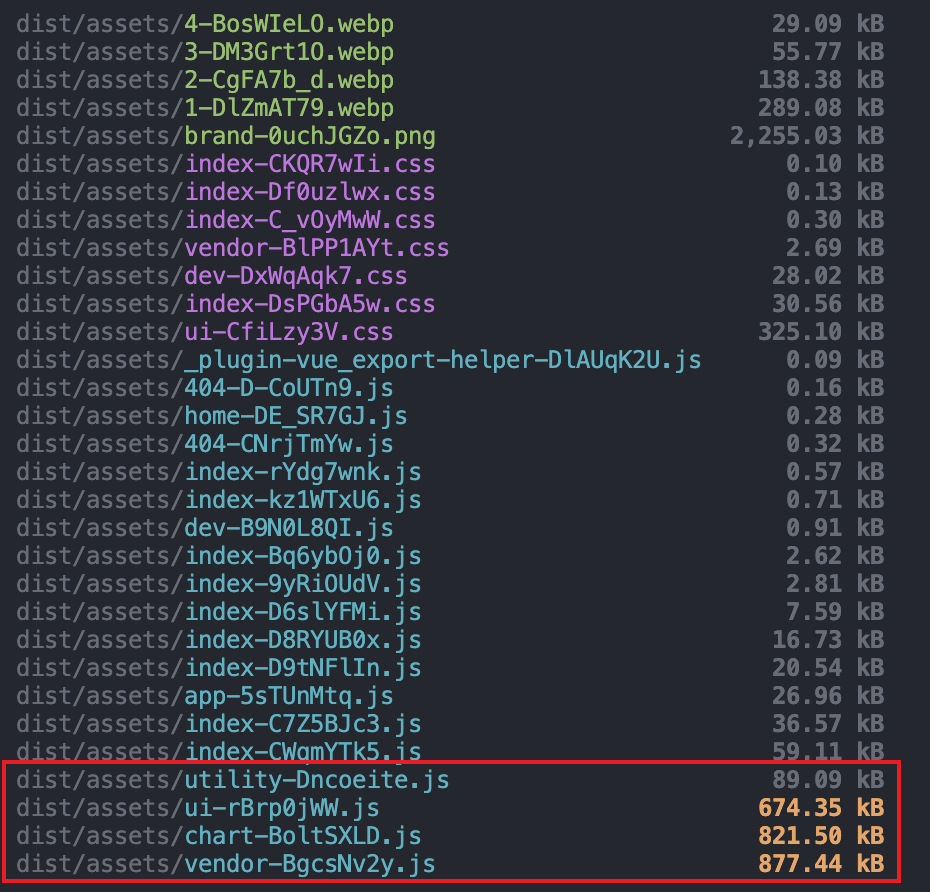

# 性能优化

## 分析依赖包大小

在开始进行打包优化前，需要先分析当前依赖包的情况，一般来说，我们需要搞清楚以下几点：

| 问题 | 解决方案 |
| -- | -- |
| 打包产物中，某些js文件是否过大？ | 合理拆包 |
| 第三方依赖是否过多导致打包变慢？ | 依赖外置 |

### Vite实现方案

安装 `rollup-plugin-visualizer` 插件：

```ts
import visualizer from 'rollup-plugin-visualizer'

export default defineConig({
  plugins: [
    visualizer({
      sourcemap: true,
    }),
  ]
})
```

::: tip
如果在分析文件中看不到具体的文件内容，需要将 `build.sourcemap` 设置为 `true` 。
:::

插件设置完成后，再次打包，在项目根目录将生成 `stats.html` 文件，在浏览器中打开该文件：


在我的这个项目里，第三方依赖被打成了两个 `js` 文件，每个文件都超过了 `1M` 。

很显然，打包产物过大，需要进行拆包处理。

并且，由于项目依赖的第三方库比较多，我们可以通过将依赖外置的方式来减少对第三方库的打包，从而加快构建速度。


## 拆包

我们先来拆包，拆包的原则是：

- 保证每个 `js` 产物不要过大；
- 如果是在HTTP1.1协议下，还要保证每个 `js` 产物不要过小，否则会打出太多的包，运行时将会阻塞导致应用启动过慢；
- `js` 产物的命名清晰。

### Vite实现方案

Vite的打包是基于rollup的（至少在Vite5及以前版本是这样的），因此，Vite没有提供拆包的配置，而是推荐用户直接覆盖rollup配置。

实现思路是修改 `build.rollupOptions.output.manualChunks` 配置，文档参考rollup的官方文档：[https://rollupjs.org/configuration-options/#output-manualchunks](https://rollupjs.org/configuration-options/#output-manualchunks) 。

这里给出一份我的实践思路，首先，提供一个配置文件 `config.ts` (位于项目目录 `build/config.ts` 中)，用户可以配置：

```ts

export type Chunks = Record<string, string[]>
export interface Config {
  /** 打包分包 */
  chunks: Chunks
}

export default {
  chunks: {
    'app': ['vue', 'vue-router', 'pinia'],
    'ui': ['element-plus'],
    'chart': ['echarts'],
    'utility': ['lodash', 'dayjs'],
  }
} as Config
```

::: tip
上述设置中，`vue` 、 `vue-router` 、 `pinia` 三个依赖包将被打入最终的 `app.js` 中。
:::

然后，在 `vite.config.ts` 中配置：

::: code-group
```ts [vite.config.ts]
export default defineConfig({
  build: {
    rollupOptions: {
      output: {
        manualChunks(id) {
          for (const [name, packages] of Object.entries(config.chunks)) {
            const pass = packages.some(packageName => id.includes(`node_modules/${packageName}\/`))
            if (pass) return name
          }
          if (id.includes('node_modules')) return 'vendor'
        },
      },
    },
  },
})
```
:::

::: tip
注意看 `manualChunks` 回调的最后一行，如果没有命中 `chunks` 中设置的规则，将会将 `node_modules` 中的依赖全部打进 `vendor.js` 中。
:::

接下来，执行打包命令验证一下拆包的结果：




## 依赖外置 + CDN

我们在写下这行代码时：

```ts
import { merge } from 'lodash'
merge(a, b)
```

执行打包时，打包器会将 `lodash` 的代码打包到最终的产物中。

我们假设这个库的大小为10M，那打包时，光花在这一个包的处理时间都会特别长。

如果我们能让最终的代码变成这样：

```ts
const { merge } = window._
```

然后在入口html中加入这么一段 `<script>` 脚本：

```html
<script src="https://cdnjs.cloudflare.com/ajax/libs/lodash.js/4.17.21/lodash.min.js"></script>
```

那打包时，我们就可以跳过 `lodash` 这个库的处理，从而节省一个库的处理时间。如果我们将所有耗时的依赖包全部外置，那理论上，打包就不需要时间。

::: tip
无论使用什么打包器（webpack、vite、rollup等），究其本质，其原理都是一样的。
:::

### Vite实现方案

在Vite中，我们可以使用 `vite-plugin-cdn-import` 插件快速实现这件事：

```ts
import cdn from 'vite-plugin-cdn-import'

export default defineConig({
  plugins: [
    cdn({
      name: 'lodash',
      var: '_',
      path: 'https://cdnjs.cloudflare.com/ajax/libs/lodash.js/4.17.21/lodash.min.js',
    })
  ]
})
```

这个插件大致做了这些事情：
- 在rollup的 `external` 配置中，新增一条 `lodash` ，保证打包时，跳过它
- 在rollup的 `output.globals` 配置中，新增一条 `lodash: '_'`，保证打包产物中，引用模块时，通过全局方式进行引用
- 在生成最终的入口html文件时，加入 `<script>` 脚本，保证最终运行时，在全局可以读取到引用


## 合理设置浏览器兼容策略

请看这段代码：

```ts
const hello = () => {
  return new Promise(() => {
    console.log('hello')
  })
}
hello()
```

当你把这段代码运行在Chrome 44版本下时，将会发生报错，这是因为，箭头函数最低在Chrome 45版本才被支持；而 `Promise` 特性在Chrome33版本得到支持。（具体参见 [caniuse](https://caniuse.com)）

为了让代码可以兼容更低版本的浏览器，一般情况下，我们需要做两件事：

- 将代码转译为旧的语法，如将箭头函数转译为普通函数，这个过程称为 `transform` ；
- 提供环境支持，例如上述代码中使用到了 `Promise` ，则需要在全局注入该特性，这个过程称为 `polyfill` 。

### Vite实现方案

在Vite中，想要实现低版本兼容，还是非常简单，只需要使用官方的 `@vitejs/plugin-legacy` 插件即可。

::: code-group
```ts [vite.config.ts]
export default defineConfig({
  legacy({
    // 根据情况设置自己的浏览器版本，或在根目录下新建.browserslistrc文件设置
    // 为了让其他插件共享配置，更推荐配置文件的方式
    // targets: ['chrome>=96'],
  }),
})
```

```bash [.browserslistrc]
# browserslist配置主要有以下两个作用
# 1. vite legacy插件为js提供polyfill
# 2. postcss autoprefixer插件为css提供prefix

[production]
last 2 versions and not dead, > 0.3%, Firefox ESR
```
:::


::: warning
注意注释的内容，尽管在legacy插件中，可以非常方便地设备目标浏览器的版本，但我们仍然建议使用 `.browserslistrc` 文件配置。

原因是，除了legacy插件需要做js相关的兼容外，css也需要，例如postcss的 `autoprefixer` 插件，如果我们在legacy插件中设置一次兼容浏览器版本，再为 `autoprefixer` 设置一次兼容浏览器版本，那就可能出现不一致的情况，为了保持一致，我们让所有工具都从源头的 `.browserslistrc` 文件中读取浏览器特性列表，从而实现兼容。
:::

那么，浏览器兼容策略为什么跟性能优化有关呢？原因是：

**不合适的（过低的）浏览器兼容版本将会导致打包速度明显下降，因为要转译的语法和补充的polyfill更多，同时，也会导致最终生成的打包产物过大。**

因此，设置兼容的浏览器版本范围时，我们需要 **切合实际去考量，到底需要最低兼容到什么版本，适当地放弃部分版本太低的用户来换取开发、构建与运行的体验和性能，这是值得的。**

::: tip
如果你的应用针对现代浏览器用户开发，那就保持默认配置即可，**less is more**。
:::

> 关于浏览器兼容设置的所有细节，请参见 [浏览器兼容](./浏览器兼容.md)。


## 去掉预处理器

TODO

## 图片压缩

TODO

## 其他小技巧

### 关闭日志

::: code-group
```ts [vite.config.ts]
export default defineConfig({
  logLevel: 'silent'
})
```
:::

::: tip
也可以设置为 `error` 仅捕捉一些错误日志。
:::

### 关闭压缩大小报告

::: code-group
```ts [vite.config.ts]
export default defineConfig({
  build: {
    reportCompressedSize: false,
  }
})
```
:::